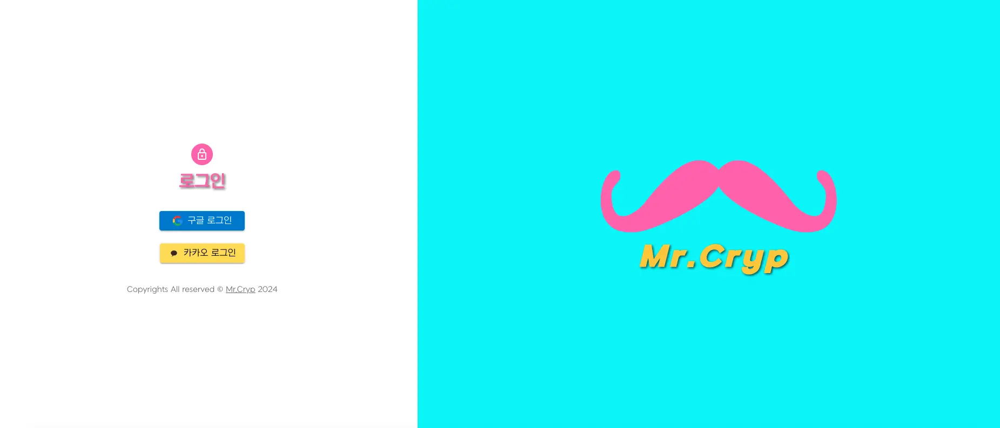
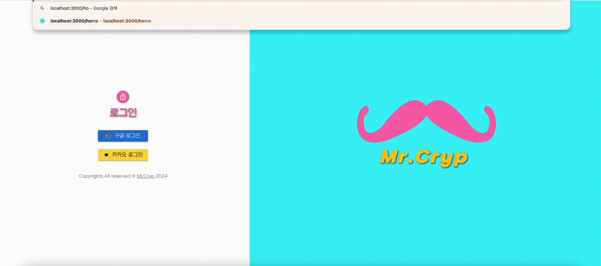
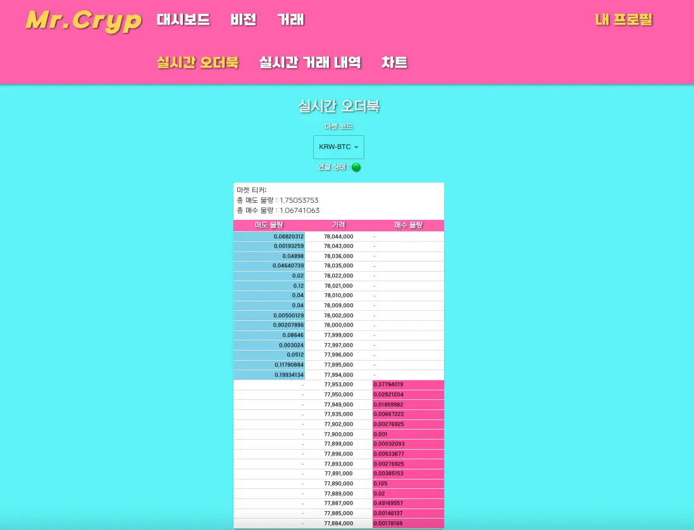
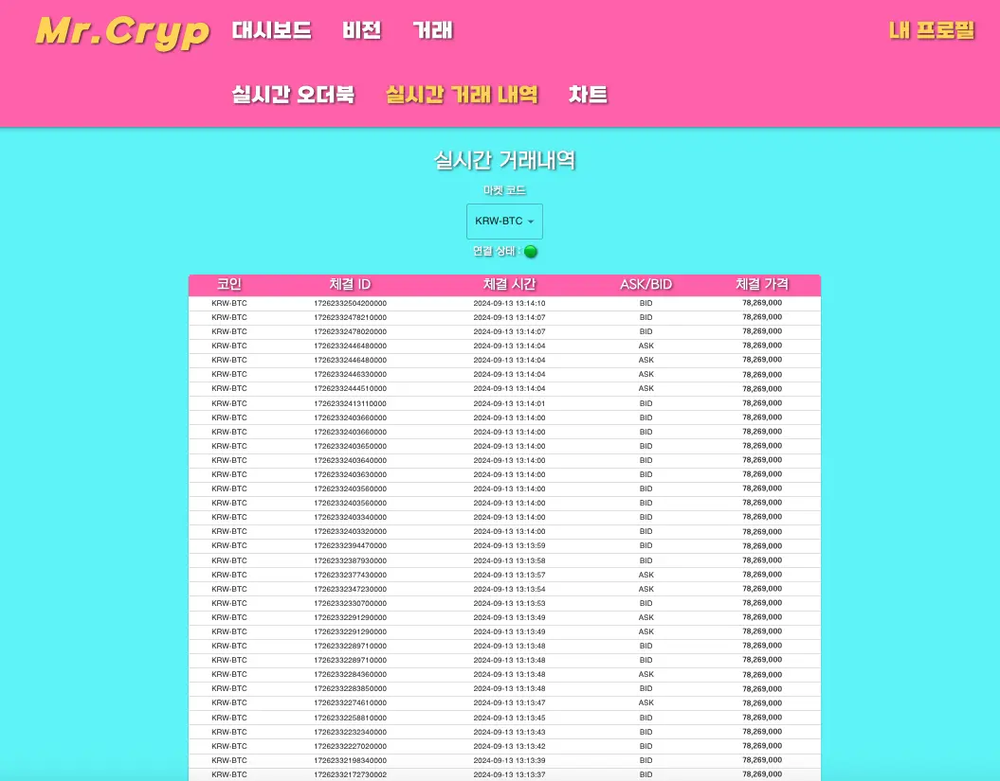
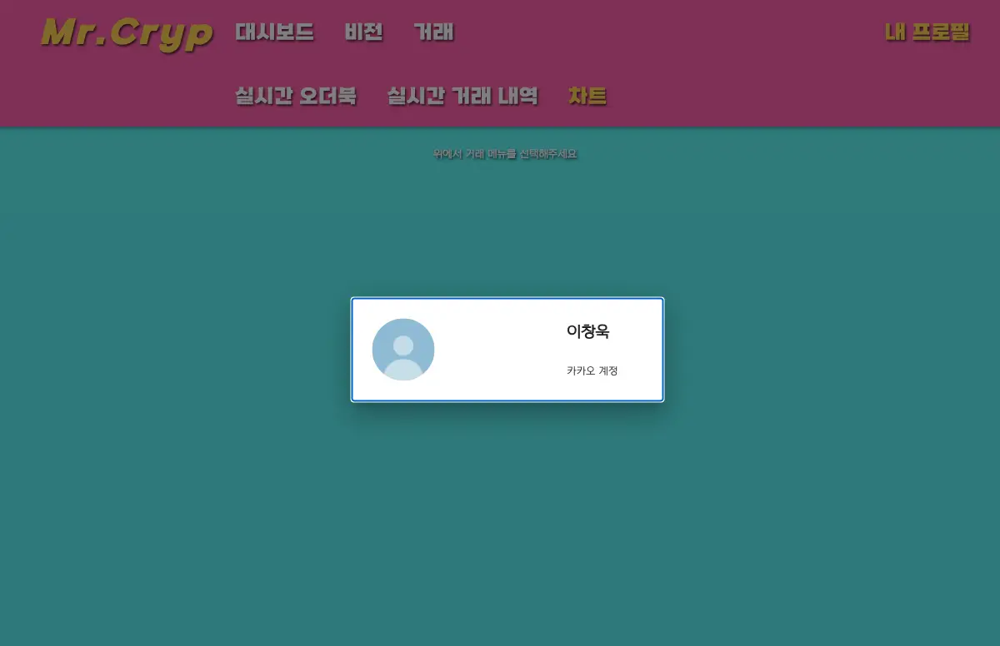
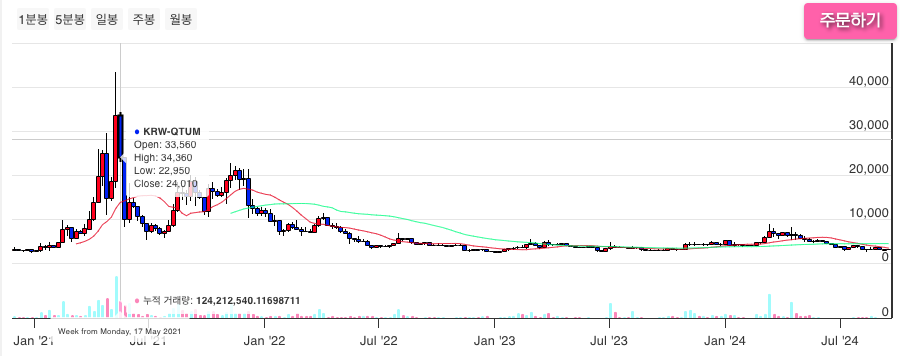
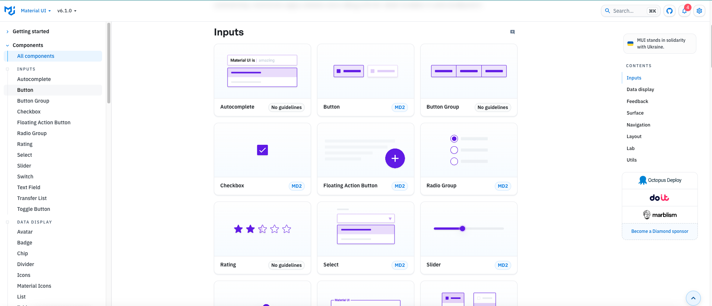

# 📈 미스터 크립 

## 📋 목차

- [🔗 접속 링크](#🔗-접속-링크)
- [✅ 스택](#✅-스택)
- [ℹ️ 페이지 소개](#ℹ️-페이지-소개)
- [📌 기술 사용 근거](#📌-기술-사용-근거)
- [🌱 개선 사항 업데이트](#🌱-개선-사항-업데이트)

### 👉 서비스 소개

미스터 크립은 업비트의 REST API를 사용하여 만든 여러분만의 크립토 비서입니다.
로그인 후 나의 업비트 계좌 잔고를 확인할 수 있고, 현재 트렌드 영상(유튜브)과 최신 뉴스(네이버)를 볼 수 있습니다. 그리고 현재 마켓들의 실시간 현재가, 거래내역, 체결 내역에 관한 정보도 확인할 수 있으며 시각화된 차트로 현재가 흐름도 쉽게 읽을 수 있습니다!
캐쥬얼한 나만의 크립토 비서가 필요하다면 미스터 크립을 추천드립니다:)

## 🔗 접속 링크
https://mr-cryp.vercel.app

## ✅ 스택

    
    
    

 

    
    

 

    
    

 

    
    
    
    
    

 

    

 

    
    
    

 

## ℹ️ 페이지 소개
### 초기 화면

로그인을 해야만 미스터 크립의 서비스를 이용할 수 있습니다. 
유저는 구글과 카카오 계정 중 원하는 것을 선택하여 로그인 후 서비스를 이용합니다. 
비로그인 상태에서 타 페이지의 접근을 막기 위한 **Protected Route** 처리도 적용했습니다.(액세스 토큰 조회) 

### 홈

로그인 후 처음 접속하는 페이지입니다. 
홈에서는 내 계좌현황을 파이 차트로 비율에 따라 한 눈에 확인할 수 있고, 
원화(현금)와 마켓별 상세 잔고 현황을 리스트로 확인할 수 있습니다. 

### 비전

가상화폐에 대한 기본적인 정보와 투자 방법에 대한 영상, 
유튜브에서 '코인'을 키워드로 검색한 최신 검색 결과 영상, 
그리고 최신 기사들을 바로 확인할 수 있는 비전 페이지 입니다. 
영상은 바로 재생이 가능하게 Iframe을 이용하였고, 기사는 링크 이동과 복사가 가능하게 구현했습니다. 

### 거래

업비트 API를 이용한 하위 3개의 페이지를 둔 거래 페이지입니다. 
네비게이션바에서 거래를 클릭시 하위 메뉴탭이 활성화됩니다. 

### 실시간 오더북

REST API -> QUOTATION API의 오더북 데이터를 호출하여 
마켓별 실시간 오더북을 보여주는 페이지입니다. 
마켓 코드 셀렉터로 원하는 마켓 코드를 선택할 수 있습니다. 

### 실시간 거래 내역

REST API -> QUOTATION API의 실시간 체결 데이터를 호출하여 
마켓별 실시간 거래 내역을 보여주는 페이지입니다. 
마켓 코드 셀렉터로 원하는 마켓 코드를 선택할 수 있습니다. 

### 실시간 차트

REST API -> QUOTATION API의 종목 중 KRW로 시작하는 종목들의 데이터로 
마켓 리스트를 구현했고 클릭으로 선택한 마켓의 상세 정보, 1분봉, 5분봉, 일봉, 주봉, 월봉 등 
시세 흐름과 현재 실시간 거래 내역 및 오더북을 보여주는 페이지입니다. 

주문하기 기능은 실제로 매수, 매도 기능을 하지는 않습니다. 
기본적으로 해당 마켓의 실시간 가격이 지정되어있고 매수와 매도 주문을 하면 
거래내역에서 주문한 내역을 모두 확인할 수 있게 상태로 저장됩니다. 

### 내 프로필

유저 정보는 네비게이션 바의 '내 프로필' 텍스트를 클릭하면 하단에 툴팁이 활성화되고, 
그 중 '프로필 정보'를 클릭하면 현재 로그인된 계정의 프로필 사진과 닉네임, 플랫폼의 정보가 표시됩니다. 

## 🧱 아키텍처
(다이어그램 삽입하기)

## 📌 기술 사용 근거
### highcharts

https://api.highcharts.com/highstock/plotOptions.candlestick

Chart.js, D3.js, Recharts와 같은 라이브러리를 뒤로 하고 highcharts를 선택한 이유는 다음과 같습니다. 

1. 캔들스틱과 OHLC 툴팁을 기본적으로 지원하여 코인 거래 데이터를 시각화하는 데에 최적화되어 있습니다. 
    또한 rangeSelector와 누적 거래량 막대 그래프를 기본 지원하여 쉽게 설정이 가능합니다. 
    이외에도 주식이나 가상화폐를 거래하기 위해 주어져야 할 데이터 시각화 요소를 기본적으로 다양하게 지원합니다.
2. 브라우저 호환성이 뛰어납니다. IE부터 파이어폭스, 사파리, 엣지, 크롬 모두 안정적으로 호환됩니다.
3. CSS 스타일 속성을 이용하여 highcharts에서 지원하는 요소의 사이즈, 컬러 등의 커스터마이징이 다양하게 가능합니다.

### MUI

https://mui.com/material-ui/all-components/

MUI는 이미 잘 만들어진 디자인과 애니메이션을 가진 UI 컴포넌트를 제공합니다.  
부트스트랩과 스타일 컴포넌트를 혼합해둔 성격을 띄고 있으며 리액트를 사용한 프로젝트에서 개발하는데에 매우 효율적입니다. 
또한 러닝 커브가 낮고 제공하는 컴포넌트 종류가 다양할 뿐만 아니라 커스터마이징 정도도 높은 수준입니다. 

### Redux Toolkit
기존의 Redux의 러닝 커브를 낮추고 장점은 극대화시킨 전역 상태관리 라이브러리입니다. 
미스터 크립의 거래 - 차트 페이지에서 마켓 리스트의 특정 마켓을 선택하면, 
해당 마켓의 market(code)를 차트 페이지에서 나머지 그리드 아이템이자 하위 컴포넌트 요소인  
마켓 상세 정보, 차트, 실시간 거래 내역, 실시간 오더북 컴포넌트에서 동기화되어야 합니다. 
상위 컴포넌트인 chart.jsx에서 useState를 이용하여 props drilling으로 하위 컴포넌트에 전달하지 않고 
상태를 중앙에서 관리함으로써 코드 가독성을 높이고, 불필요한 렌더링을 줄여 성능 최적화에 도움이 됩니다. 

### Next.js
미스터 크립은 원래 리액트로만 만들어진 프로젝트였습니다. 
그래서 리액트와 use-upbit-api라는 라이브러리를 사용하여 업비트의 웹소켓 API를 사용하여 
실시간 오더북, 실시간 거래내역, 실시간 가격, 캔들 데이터 등을 받아 유저가 보기 쉬운 정보로 보여주었습니다. 
하지만 배포 후 CORS 에러가 발생하는 것을 알게 되었고 github.io에서도 동일한 것을 알았습니다. 
이를 해결하기 위해 use-upbit-api를 사용하는 방식을 포기하고, Next를 사용하여 서버사이드 API 호출 및 렌더링을 사용하여 
CORS 에러를 해결하고, 초기 렌더링시 많은 데이터 페칭이 일어나는 미스터 크립의 서비스 특성에 맞게 마이그레이션했습니다.

## 🌱 개선 사항 업데이트
### 다음 업데이트시 추가될 사항 (v1.1)
- 네이버 로그인 추가
- 마켓 리스트에 검색 기능 추가
